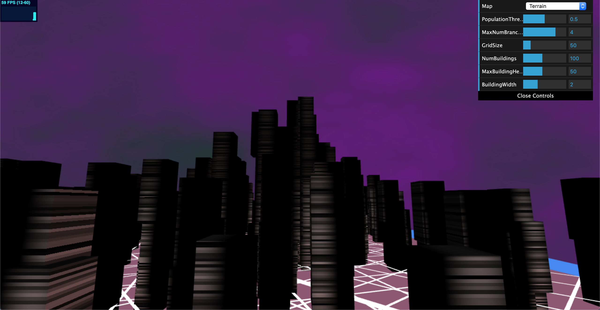
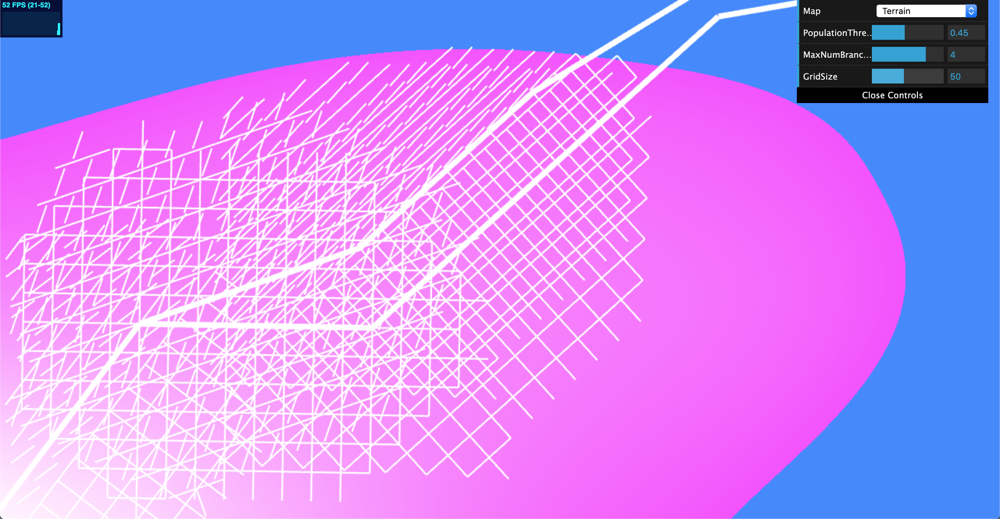
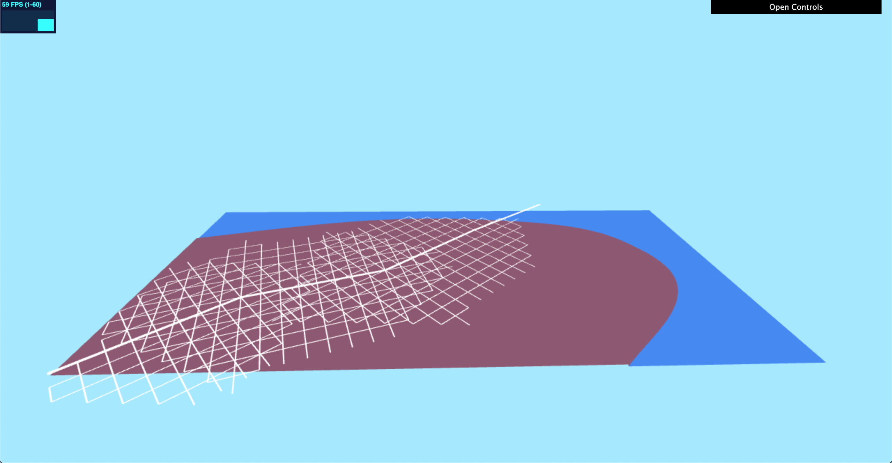
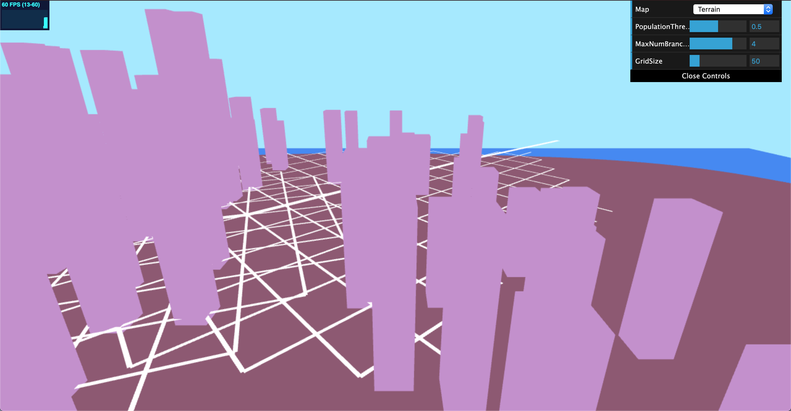
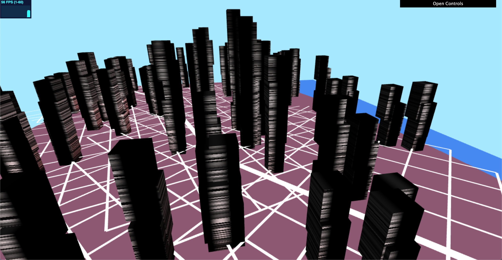

# City Generation
Name: Crystal Lee

PennKey: leecr

Email: leecr@seas.upenn.edu

[Website](crystaljlee.com)

## Live Project Demo
[Link](https://leecr97.github.io/city-generation/)

## Project Description
This project is a procedural 3D city generator. It builds on and expands upon a previous project of mine, [2D Road Generation](https://github.com/leecr97/road-generation). In the Road Generation project, I used shape grammars and a modified L-system to create a 2D city map generator, as well as instanced rendering to draw road networks. In this project, I generate a collection of 3D buildings within the road networks I created in the previous project.

The terrain of my scene is a 3D model of the 2D terrain texture created for the Road Generation project. The roads are also rebuilt as rectangular prisms slightly above the ground. To determine valid places where a building can be placed, a high-resolution 2D grid is used to "rasterize" the roads and the water. Buildings are then randomly placed in valid places in this grid, AKA any points that are not occupied by roads or water.

Our scene also contains population data of our city, which is used to influence the placement of buildings (and roads, as detailed in the previous project). Buildings do not appear below a certain population threshold, and buildings in areas of higher population density are taller.

Buildings are generated using an algorithm described in the "Real-time Procedural Generation of 'Pseudo Infinite' Cities" paper (see in References for more info). Beginning at a predetermined top height, an n-sisded polygon is generated and extruded downwards a certain distance. After creating this first layer, an additional layer is created beneath that has the form of two polygons combined together and is also extruded downwards. This process is repeated until the building has reached the ground. These buildings are then rendered using instanced rendering by creating VBO data on the CPU. The buildings are additionally textured using procedurally animated noise functions.

The background is textured using procedural noise functions to look like a dark sky that is congruent with the aesthetics of my city. The color of the background at every point is calculated using Fractal Brownian Motion of a simple 2D noise function.

Additionally, there is a provided GUI that allows the user to modify certain aspects of the scene. Same as the previous project, the user can change the population threshold that is used to determine population centers in our basic road branching algorithm, the number of rays that will be sampled in our road-building algorithm, and the maximum block width of our smaller streets. New for this project, the user can now change the maximum number of buildings generated, as well as the maximum height a building can reach and the dimensions of each building.

Click on the live demo to see it in action! (Note: the performance may suffer when large values are inputted using the GUI.)

## Images

The city road map created in the last project, which was used to build the 3D city in this project:

Note the incorrect L-System, which was fixed in this project.

The 3D terrain model with roads

Basic buildings placed in valid positions

Textured buildings

## References
[Real-time Procedural Generation of 'Pseudo Infinite' Cities](https://github.com/leecr97/city-generation/blob/master/procedural_infinite_cities.pdf) by Stefan Greuter, Jeremy Parker, Nigel Stewart, Geoff Leach